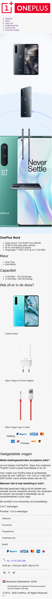
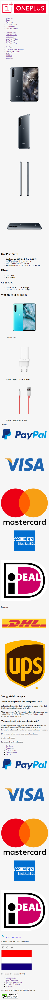
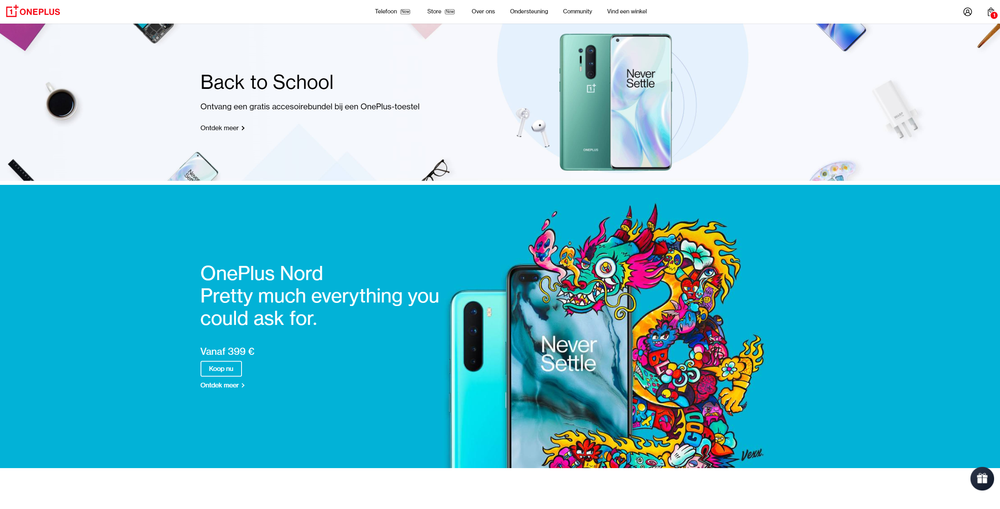
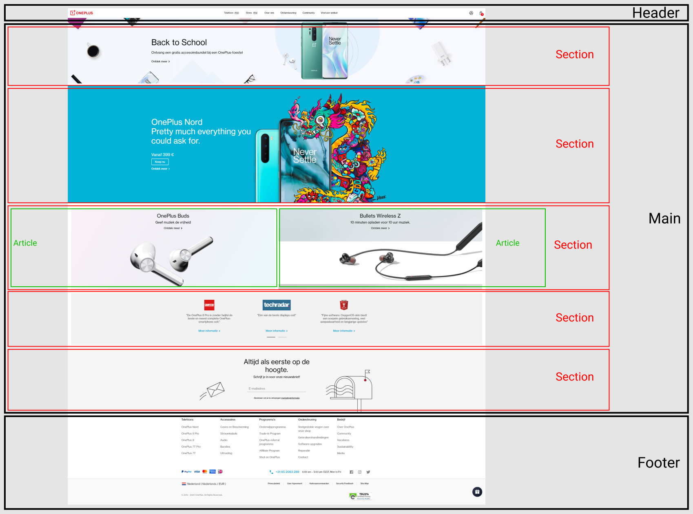
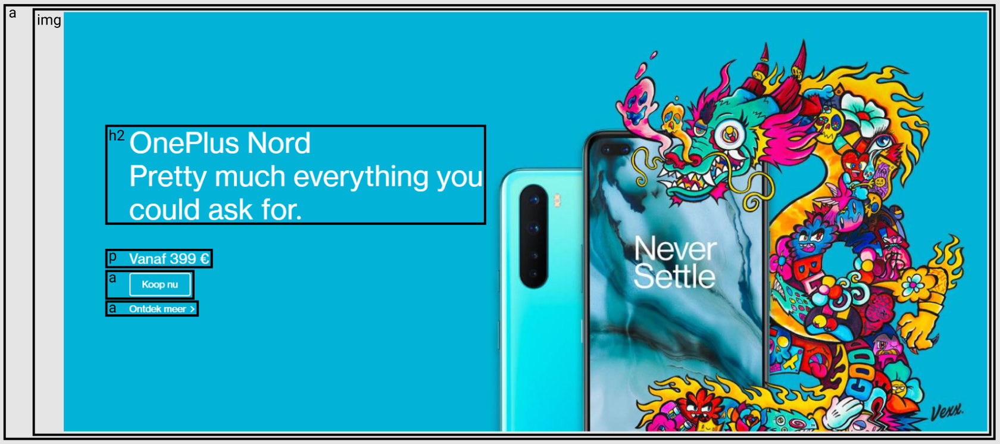
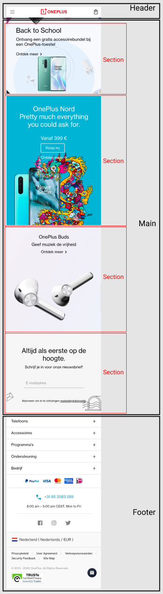
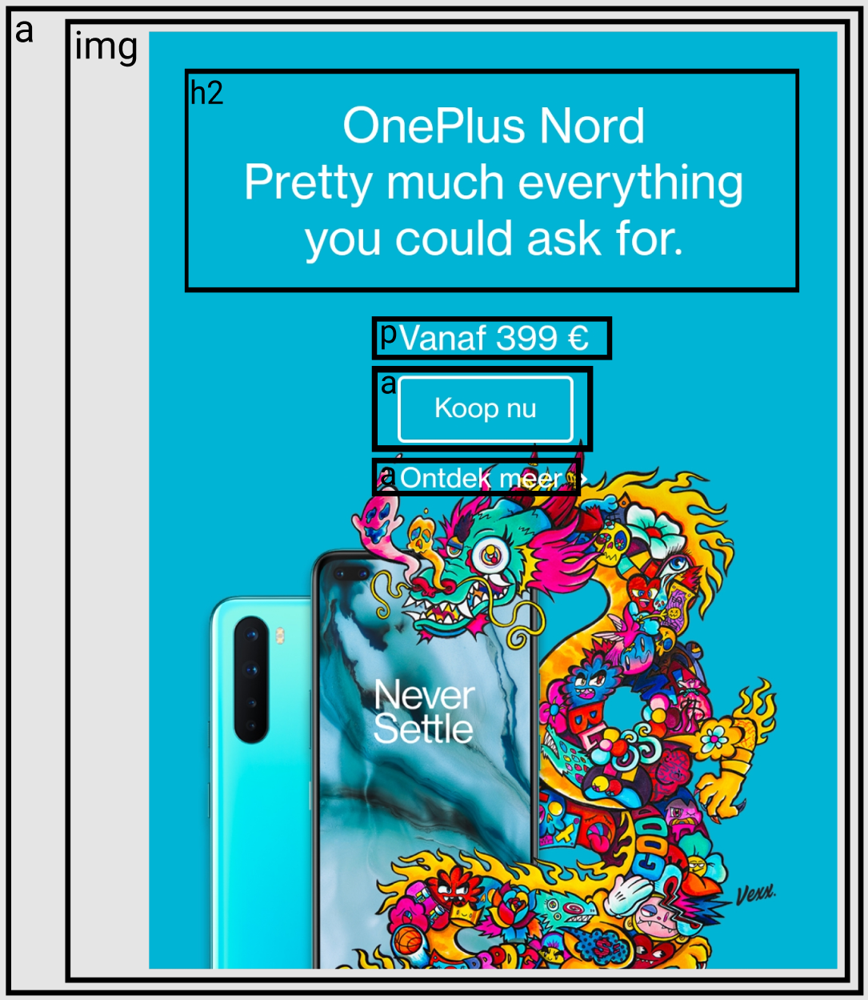

# Procesverslag
**Auteur:** -jouw naam-

Markdown cheat cheet: [Hulp bij het schrijven van Markdown](https://github.com/adam-p/markdown-here/wiki/Markdown-Cheatsheet). Nb. de standaardstructuur en de spartaanse opmaak zijn helemaal prima. Het gaat om de inhoud van je procesverslag. Besteedt de tijd voor pracht en praal aan je website.

## Bronnenlijst
1. https://w3bits.com/animated-menu-icon-css/
2. https://www.oneplus.com/nl
3. -...-

## Eindgesprek (week 7/8)

-dit ging goed & dit was lastig-

**Screenshot(s):**

-screenshot(s) van je eindresultaat-

## Voortgang 3 (week 6)

### Stand van zaken

De styling is zo goed als af! Hier en daar nog een paar details bijwerken en het laatste deel van de 2e pagina stylen. Het schrijven van CSS vond ik goed te doen. Hier en daar moest ik wel wat basis dingen opzoeken maar over het algemeen wist ik met de basis info mijn eigen styling te maken. Waar ik wel tegen aan loop is het efficiënt code schrijven. Ik combineer veel selectoren maar vind werken met classes soms makkelijker. Ik heb erg veel regels CSS en hoop dat dit geen probleem vormt bij de beoordeling. Ik moet proberen meer comments in mijn CSS te plaatsen om de overdraagbaarheid en begrijpbaarheid te vergroten. Ik ga nu aan de slag met JS.
Nu ik de afgelopen dagen veel heb gewerkt aan de website zit ik in een goede flow. Nu hoop ik dat dit zo blijft, zodat ik alles optijd af kan hebben.

**Screenshot(s):**

## Voortgang 2 (week 5)

### Stand van zaken

Deze week heb ik vooral aan de footer gewerkt. De footer is nu bijna af, op een paar details na. Ook ben ik begonnen met het stylen van de eerste section. Ik heb nog erg veel te doen en blijf het lastig vinden om motivatie op te brengen. Ik ga komende week proberen om m'n styling af te krijgen zodat ik daarna kan beginnen met JavaScript.

**Screenshot(s):**

## Voortgang 1 (week 3)

### Stand van zaken

Het was lastig om weer alles weer terug te halen. Wel was het redelijk te doen om de HTML van de bestaande website zelf te schrijven.
Aan de CSS ben ik niet toe gekomen. Dat gaat nog een challenge zijn.
Ik neig nu naar mijn focus leggen op JS, ik krijg tijdens het bekijken van de website namelijk al allerlei ideeën over hoe ik dat zou gaan doen.

**Screenshot(s):**

## Intake (week 1)

**Je startniveau:** Rood

**Je focus:** Surface

**Je opdracht:** https://www.oneplus.com/nl

**Screenshot(s):**

<!--  -->

**Breakdown-schets(en):**

<!-- 
 -->

